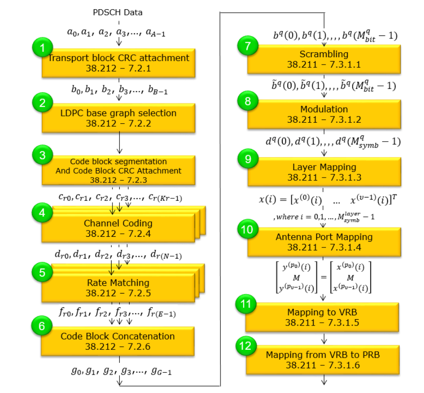
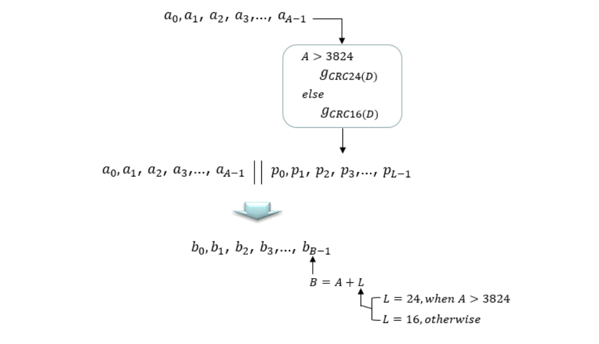
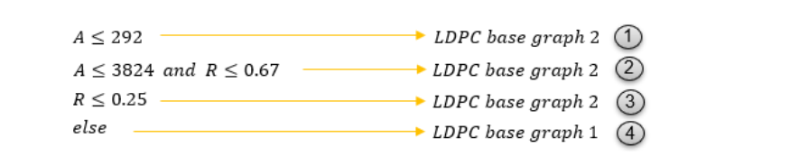
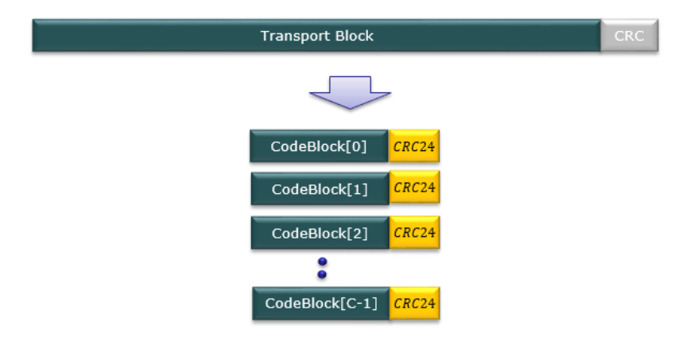
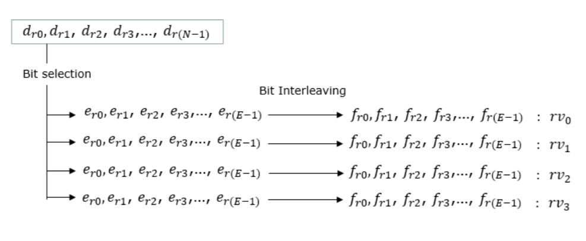
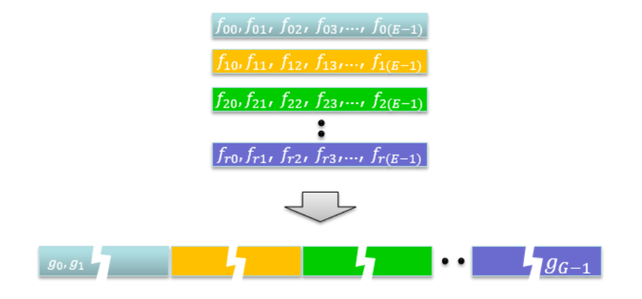
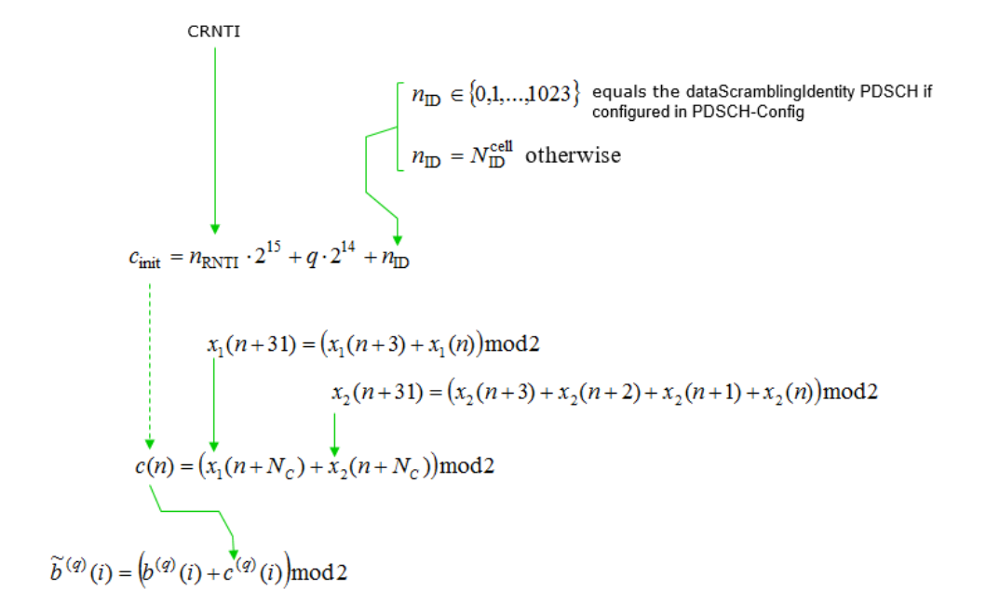

# 5G NR (New Radio) PDSCH Transceiver Chain
PDSCH is a downlink physical channel that deliver user data from gNodeB to UE. This project includes -

• At Transmitter side Transport Block goes through CRC Insertion, Transport block Segmentation, Calculation and Insertion of per-code-block CRC, LDPC Encoding, Rate Matching, Inter-leaver, Code Block Concatenation, Scrambler, Modulation.

• On the receiving end, Transport Block goes through Demodulation, Descrambler, Code Block Segmentation, Deinterleaver, Rate Recovery, LDPC Decoding, Removal of per code block CRC, Code Block Concatenation, Transport Block CRC Removal.

## PDSCH Transport Process
Following diagram outlines the PDSCH (Physical Downlink Shared Channel) Transport Process and shows corresponding 3GPP specification for each process.

### • Transport block CRC attachment :
The transport block CRC attachment in 5G PDSCH channel processing is a step that allows the UE to detect errors in the received transport block, ensuring reliable data transmission over the wireless channel.  a CRC is calculated for the transport block to enable error detection at the receiver (UE). The CRC is a fixed-size checksum generated by applying a polynomial function to the transport block data. In 5G NR, a 24-bit or 16 bit CRC is attached to the transport block depending on the size of the transport block.

**Let's break this down into steps:**

- The data from the transport block, represented as a sequence of bits a0, a1, a2, ..., aA-1, is prepared for CRC attachment to enable error detection at the receiver end.
  
- If the size of the transport block A is greater than 3824, a 24-bit CRC is attached using the generator polynomial GCRC24(D).
  
- If the size of the transport block A is less than or equal to 3824, a 16-bit CRC is used instead, with the polynomial GCRC16(D).
  
- The CRC is computed and appended to the data sequence, resulting in an extended sequence a0, a1, a2, ..., aA-1 | p0, p1, p2, ..., pL-1.
  
- The length L of the CRC is set to 24 when A > 3824 and 16 otherwise, to accommodate the CRC bits.
  
- The resulting sequence after CRC attachment is represented as b0, b1, b2, ..., bB-1, where B = A + L, indicating the new length of the sequence.
  
- This CRC attachment process is essential for ensuring reliable data transmission over the wireless channel by allowing error detection at the UE.

### • LDPC base graph selection:
LDPC graph selection is the step that enables efficient channel coding tailored to the transport block size, ensuring reliable data transmission and optimized performance.

5G NR specifies two base graphs for LDPC encoding, known as Base Graph 1 and Base Graph 2. Each base graph has a predefined size, with Base Graph 1 being larger than Base Graph 2.

The selection of a base graph depends on the size of the transport block being transmitted over the PDSCH. If the transport block size is larger than a certain threshold, Base Graph 1 is used; otherwise, Base Graph 2 is employed. The smaller Base Graph 2 is more suitable for smaller transport blocks, as it offers a better trade-off between complexity and performance.

**LDPC BaseGraph type is determined by Transport Size (A) and Code Rate(R)  based on following criteria -**

### • Code block segmentation And Code Block CRC Attachment :
This step is to ensure efficient and reliable data transmission by dividing large transport blocks into smaller segments and providing error detection capabilities at the code block level. We can think of this with a few different perspectives/steps summarized below.

- **Code Block Segmentation:** If the size of a transport block is too large for efficient LDPC (Low-Density Parity-Check) coding, it is divided into smaller segments, called code blocks. The maximum size of a code block is defined by the 5G NR specifications. Segmentation is performed to ensure efficient channel coding and decoding while maintaining a reasonable complexity.

- **Segmentation Criteria:** The segmentation process is determined by comparing the transport block size with a specified maximum code block size. If the transport block size exceeds the maximum code block size, the transport block is divided into equal-sized code blocks (with the exception of the last code block, which may be smaller). If the transport block size is within the maximum code block size, no segmentation is performed.

- **Code Block CRC Attachment:** After segmentation, a CRC (Cyclic Redundancy Check) is calculated and attached to each code block individually. This 24-bit CRC allows for error detection at the receiver (UE) on a per-code-block basis.

