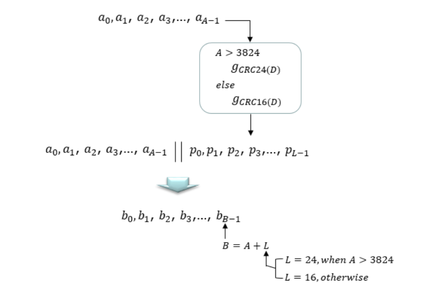

# 5G NR (New Radio) PDSCH Transceiver Chain
PDSCH is a downlink physical channel that deliver user data from gNodeB to UE. This project includes -

• At Transmitter side Transport Block goes through CRC Insertion, Transport block Segmentation, Calculation and Insertion of per-code-block CRC, LDPC Encoding, Rate Matching, Inter-leaver, Code Block Concatenation, Scrambler, Modulation.

• On the receiving end, Transport Block goes through Demodulation, Descrambler, Code Block Segmentation, Deinterleaver, Rate Recovery, LDPC Decoding, Removal of per code block CRC, Code Block Concatenation, Transport Block CRC Removal.

## PDSCH Transport Process
Following diagram outlines the PDSCH (Physical Downlink Shared Channel) Transport Process and shows corresponding 3GPP specification for each process.

