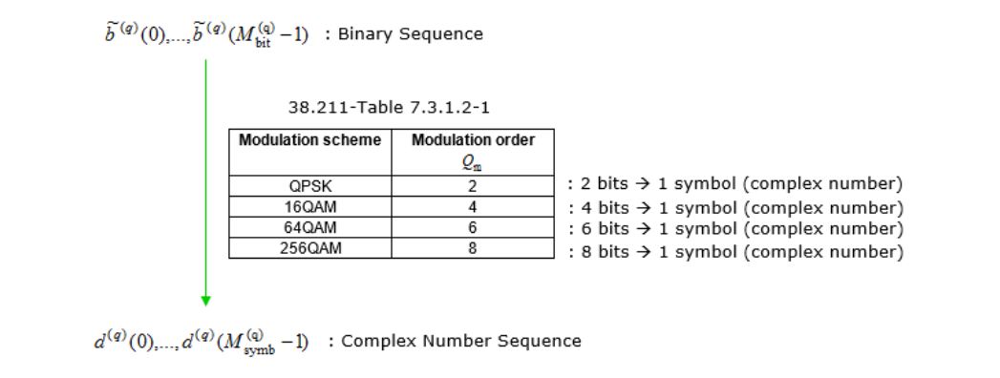

# 5G NR (New Radio) PDSCH Transceiver Chain
PDSCH is a downlink physical channel that deliver user data from gNodeB to UE. This project includes -

• At Transmitter side Transport Block goes through CRC Insertion, Transport block Segmentation, Calculation and Insertion of per-code-block CRC, LDPC Encoding, Rate Matching, Inter-leaver, Code Block Concatenation, Scrambler, Modulation.

• On the receiving end, Transport Block goes through Demodulation, Descrambler, Code Block Segmentation, Deinterleaver, Rate Recovery, LDPC Decoding, Removal of per code block CRC, Code Block Concatenation, Transport Block CRC Removal.

## PDSCH Transport Process
Following diagram outlines the PDSCH (Physical Downlink Shared Channel) Transport Process and shows corresponding 3GPP specification for each process.

### • Transport block CRC attachment -
The transport block CRC attachment in 5G PDSCH channel processing is a step that allows the UE to detect errors in the received transport block, ensuring reliable data transmission over the wireless channel.  a CRC is calculated for the transport block to enable error detection at the receiver (UE). The CRC is a fixed-size checksum generated by applying a polynomial function to the transport block data. In 5G NR, a 24-bit or 16 bit CRC is attached to the transport block depending on the size of the transport block.

**Let's break this down into steps :**

- The data from the transport block, represented as a sequence of bits a0, a1, a2, ..., aA-1, is prepared for CRC attachment to enable error detection at the receiver end.
  
- If the size of the transport block A is greater than 3824, a 24-bit CRC is attached using the generator polynomial GCRC24(D).
  
- If the size of the transport block A is less than or equal to 3824, a 16-bit CRC is used instead, with the polynomial GCRC16(D).
  
- The CRC is computed and appended to the data sequence, resulting in an extended sequence a0, a1, a2, ..., aA-1 | p0, p1, p2, ..., pL-1.
  
- The length L of the CRC is set to 24 when A > 3824 and 16 otherwise, to accommodate the CRC bits.
  
- The resulting sequence after CRC attachment is represented as b0, b1, b2, ..., bB-1, where B = A + L, indicating the new length of the sequence.
  
- This CRC attachment process is essential for ensuring reliable data transmission over the wireless channel by allowing error detection at the UE.

### • LDPC base graph selection -

LDPC graph selection is the step that enables efficient channel coding tailored to the transport block size, ensuring reliable data transmission and optimized performance.

5G NR specifies two base graphs for LDPC encoding, known as Base Graph 1 and Base Graph 2. Each base graph has a predefined size, with Base Graph 1 being larger than Base Graph 2.

The selection of a base graph depends on the size of the transport block being transmitted over the PDSCH. If the transport block size is larger than a certain threshold, Base Graph 1 is used; otherwise, Base Graph 2 is employed. The smaller Base Graph 2 is more suitable for smaller transport blocks, as it offers a better trade-off between complexity and performance.

**LDPC BaseGraph type is determined by Transport Size (A) and Code Rate(R)  based on following criteria -**

### • Code block segmentation And Code Block CRC Attachment -
This step is to ensure efficient and reliable data transmission by dividing large transport blocks into smaller segments and providing error detection capabilities at the code block level. We can think of this with a few different perspectives/steps summarized below.

- **Code Block Segmentation:** If the size of a transport block is too large for efficient LDPC (Low-Density Parity-Check) coding, it is divided into smaller segments, called code blocks. The maximum size of a code block is defined by the 5G NR specifications. Segmentation is performed to ensure efficient channel coding and decoding while maintaining a reasonable complexity.

- **Segmentation Criteria:** The segmentation process is determined by comparing the transport block size with a specified maximum code block size. If the transport block size exceeds the maximum code block size, the transport block is divided into equal-sized code blocks (with the exception of the last code block, which may be smaller). If the transport block size is within the maximum code block size, no segmentation is performed.

- **Code Block CRC Attachment:** After segmentation, a CRC (Cyclic Redundancy Check) is calculated and attached to each code block individually. This 24-bit CRC allows for error detection at the receiver (UE) on a per-code-block basis.

### • Channel Coding -
Detailed procedure of LDPC as described in 38.212 - 5.3.2 which is out of scope of this section (Beyond my knowledge as well :). Overall process can be summarized as below.

- **Parity Check Matrix:** The LDPC codes are defined by a sparse parity-check matrix that represents the relationship between the data bits and the parity bits. 5G NR specifies two base graphs (Base Graph 1 and Base Graph 2) to construct the parity-check matrix, depending on the transport block size.

- **Encoding:** The LDPC encoding process takes the segmented code blocks (with attached CRC) as input and generates parity bits based on the chosen base graph and lifting factor. These parity bits are then appended to the original data bits, forming a codeword that is transmitted over the PDSCH.
  
### • Rate Matching -

The Purpose of Rate matching is to adapts the output data rate of the channel encoder (LDPC) to match the available resources allocated for transmission in the time-frequency grid of the PDSCH. It can be describe in a few different steps as follows :

- **Bit Collection: **After LDPC coding, the encoded bits (data bits and parity bits) are collected in a circular buffer. The circular buffer is a temporary storage area with a fixed size that can hold bits in a circular manner, allowing for efficient bit selection.

- **Bit Selection:** Depending on the allocated PDSCH resources, a specific number of bits are selected from the circular buffer. The selection process involves three main operations: bit interleaving, bit pruning, and bit puncturing.

- **Bit Interleaving:** Rearranges the order of the bits to improve the robustness against burst errors during transmission.

- **Bit Pruning:** Removes any extra redundancy bits generated by the LDPC encoder

- B**it Puncturing:** Discards some of the encoded bits (usually parity bits) if the number of encoded bits exceeds the allocated resources.

### • Code Block Concatenation -

This is the step that combines the multiple code blocks resulting from the previous processing steps into a single data stream for transmission.

After rate matching, the processed code blocks are combined into a single data stream. The concatenation is performed in a specific order to ensure that the receiver (UE) can correctly separate and decode the individual code blocks. Typically, the code blocks are concatenated in the order they were segmented from the original transport block.

### • Scrambling -
Scrambling process is the step that introduces randomness to the transmitted data, ensuring uniform power distribution, interference management, data privacy, and accurate channel estimation. Scrambling and descrambling operations are performed at the transmitter and receiver, respectively, using the same cell-specific scrambling sequence. Scrambling introduces randomness to the transmitted data by applying a pseudo-random binary sequence (PRBS) to the data stream. This operation ensures that the transmitted signal has a uniform power distribution across different frequency and time resources. Scrambling also aids in mitigating inter-cell interference, improving data privacy, and allowing the receiver (UE) to perform accurate channel estimation. Some of highlights of this process are :

- **Scrambling Sequence :** The scrambling process uses a cell-specific scrambling sequence generated based on the cell ID and a scrambling identity. The scrambling identity can be unique for each user (UE) within a cell, ensuring that the scrambling sequences used by different UEs are orthogonal to each other.
  
- **Bitwise XOR :** The scrambling process involves a bitwise exclusive-or (XOR) operation between the input data stream (resulting from the code block concatenation step) and the scrambling sequence. The output of this operation is a scrambled data stream.

- **Impact on Data Rate :** Scrambling does not change the data rate, as it only modifies the data stream by introducing randomness. The data rate is determined by other channel processing steps, such as LDPC encoding and rate matching.

### • Modulation -

The modulation step is essential for converting the binary data stream into complex symbols suitable for wireless transmission. The choice of modulation scheme affects the data rate, spectral efficiency, and robustness against noise and interference. In 5G, 4 different modulation schemes are supported as of now.

- **QPSK :** QPSK modulates 2 bits per symbol, offering low data rates with high robustness against noise and interference.

- **16QAM :** 16QAM modulates 4 bits per symbol, providing a balance between data rate and robustness.

- **64QAM :** 64QAM modulates 6 bits per symbol, enabling higher data rates but with reduced robustness compared to QPSK and 16QAM.

-** 256QAM :** 256QAM modulates 8 bits per symbol, offering the highest data rates with the lowest robustness among the supported modulation schemes.

The choice of modulation scheme depends on factors such as channel conditions, link adaptation, and UE capabilities.

